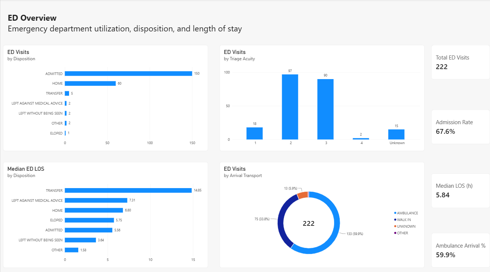
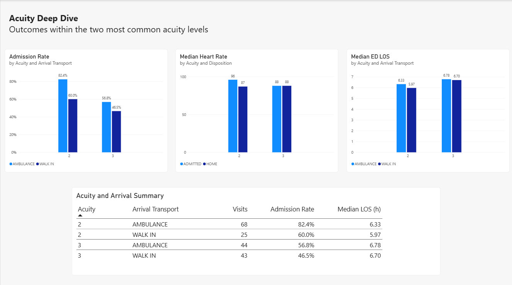

# MIMIC-IV-ED Emergency Department Analysis

## Overview

This project is an end-to-end healthcare data analysis using the MIMIC-IV-ED Demo dataset.

The main question was:

> **How do triage acuity and arrival characteristics relate to ED disposition and length of stay?**

I used PostgreSQL and SQL to validate and analyze the data, then built a two-page Power BI dashboard to summarize ED activity and explore differences within the most common triage acuity levels.

---

## Dashboard

### ED Overview



### Acuity Deep Dive



---

## Dataset

The project uses the **MIMIC-IV-ED Demo** dataset from PhysioNet.

Four tables were used:

| Table | Rows | Main Use |
|---|---:|---|
| `edstays` | 222 | ED visits, arrival transport, disposition, and timestamps |
| `triage` | 222 | Acuity and initial vital signs |
| `diagnosis` | 545 | ICD diagnosis information |
| `vitalsign` | 1,038 | Repeated vital-sign measurements |

The original source data is not included in this repository.

---

## Tools

- PostgreSQL
- pgAdmin 4
- SQL
- Power BI Desktop
- GitHub

---

## Analysis Approach

I focused on a simple and reproducible analysis process:

- Checked missing values, duplicates, numeric ranges, and table relationships
- Calculated ED length of stay and reviewed extreme values
- Compared admission rates and LOS across disposition and triage acuity
- Performed a deeper comparison of ambulance and walk-in visits within acuity levels 2 and 3
- Created a final SQL view with **one row per ED stay** for Power BI

Diagnosis-level comparisons were also explored, but individual diagnosis groups were too small for meaningful comparison.

---

## Key Findings

### 1. Triage acuity was related to admission outcome

Admission rates decreased as triage acuity became less urgent:

- Acuity 1: **94.4%**
- Acuity 2: **77.3%**
- Acuity 3: **52.2%**

Acuity levels 2 and 3 contained most of the visits and were used for the main subgroup analysis.

### 2. Ambulance arrivals had higher admission rates within the same acuity level

Within acuity 2:

- Ambulance: **82.4%**
- Walk-in: **60.0%**

Within acuity 3:

- Ambulance: **56.8%**
- Walk-in: **46.5%**

This shows that triage acuity alone did not fully separate admission outcomes in this demo dataset.

### 3. Median LOS was similar by arrival mode

Although admission rates differed, median ED LOS was similar between ambulance and walk-in visits.

| Acuity | Ambulance | Walk-in |
|---:|---:|---:|
| 2 | 6.33 h | 5.97 h |
| 3 | 6.78 h | 6.70 h |

Arrival transport showed a stronger difference in admission outcome than in ED LOS.

### 4. Median was a better summary of LOS than the average

Overall ED LOS was:

- Average: **8.10 h**
- Median: **5.84 h**

Several stays lasted more than 24 hours, including two above 72 hours. These long stays increased the average, so median LOS was used as the main LOS measure.

---

## Data Quality Notes

The main data-quality findings were:

- All 222 ED stays matched to a triage record
- 221 of 222 stays had diagnosis records
- 206 of 222 stays had repeated vital-sign records
- One temperature value of **36.5°F** and one DBP value of **879 mmHg** were identified as implausible
- Rhythm was missing in approximately 97% of repeated vital-sign records

Suspicious values were not manually corrected because the true original values were unknown.

---

## Limitations

- This analysis uses only **222 visits from the MIMIC-IV-ED Demo dataset**, so the results should not be generalized to all ED patients.
- Some groups were very small, especially acuity 4 and several disposition categories.
- Individual primary diagnoses were too sparse for stable diagnosis-level comparisons.
- The dataset does not include operational factors such as staffing, bed availability, boarding time, or lab and imaging turnaround times.
- The analysis is descriptive and shows associations, not causal relationships.

For example, higher admission rates among ambulance arrivals do not mean that ambulance transport itself causes admission.

---

## Reproducing the Analysis

To reproduce this project:

1. Download the [MIMIC-IV-ED Demo v2.2 dataset](https://physionet.org/content/mimic-iv-ed-demo/2.2/) from PhysioNet.
2. Create a PostgreSQL database named `mimic_ed`.
3. Run `01_database_setup.sql` to create the tables.
4. Import the following CSV files into their corresponding tables:
   - `edstays.csv`
   - `triage.csv`
   - `diagnosis.csv`
   - `vitalsign.csv`
5. Run the remaining SQL files in order:
   - `02_data_quality.sql`
   - `03_exploratory_analysis.sql`
   - `04_final_analysis.sql`

The original CSV files are not included in this repository.

---

## Repository Structure

```text
mimic-iv-ed-analysis/
│
├── README.md
│
├── sql/
│   ├── 01_database_setup.sql
│   ├── 02_data_quality.sql
│   ├── 03_exploratory_analysis.sql
│   └── 04_final_analysis.sql
│
├── powerbi/
│   └── MIMIC_IV_ED_Analysis.pbix
│
└── images/
    ├── Ed_Overview.png
    └── Acuity_Deep_Dive.png
